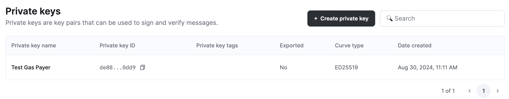
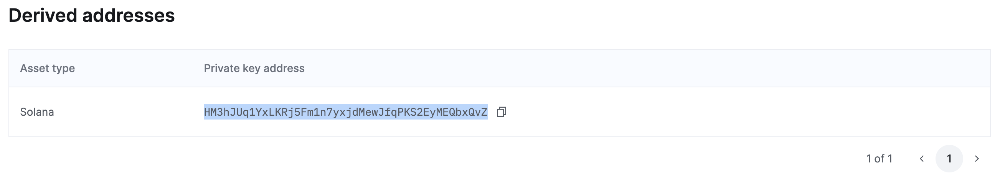

# Build a Paymaster on Solana using Turnkey

Want to pay for gas on behalf of your users? Don't want to be a money transmitter? Lucky you! This guide will walk you through the process of using Turnkey's API with Solana Web3 JS to build a transaction whose fee will be paid by a Turnkey wallet you control and send it to your backend. Your backend will then request a signature from Turnkey and return it to the client. The fully signed transaction can finally be broadcast to the Solana network for execution.

All example code is included including some utilities I used in my project. (such as Helius' RPC proxy)

## Prerequisites

Before you begin, make sure you have the following:

- Turnkey account & API Credentials
- Create a Turnkey private key

- Get the derived public key address

- Install dependencies:

### Frontend:
```
npm i @solana/web3.js
```

### Backend:
```
npm i @solana/web3.js @turnkey/solana @turnkey/sdk-server
```

## Step 1: Frontend Implementation

In this example we'll do a simple SPL token send from user A -> user B and have our Turnkey paymaster pay the network fee. In your frontend code, build the transaction. 

```typescript
    const transaction = new Transaction().add(
        createTransferInstruction(
            fromTokenAccount.address,
            toTokenAccount.address,
            fromKeypair.publicKey,
            1000000, // 1 USDC
            [],
            TOKEN_PROGRAM_ID
        )
    );
```
Tell Solana that the fee payer for this transaction will be your Turnkey address, then give a partial signature from user A.

```typescript
transaction.feePayer = new PublicKey(TURNKEY_PUBLIC_KEY)
transaction.recentBlockhash = (await connection.getLatestBlockhash()).blockhash;
transaction.partialSign(fromKeypair)
```
Send the transaction to your backend to be signed by your Turnkey address.
```typescript
const serializedTransaction = transaction.serialize({ requireAllSignatures: false }).toString('base64');
    console.log("[executeUSDCTransfer] Hitting backend", serializedTransaction)
    const response = await fetch(`https://yourbackend.io/api/paymaster`, {
        method: 'POST',
        headers: {
            'Content-Type': 'application/json',
            'Authorization': `Bearer 123`
        },
        body: JSON.stringify({ transaction: serializedTransaction })
    })
```

## Step 2: Backend Implementation
In your backend, add the following code (or have chatgpt convert it to your BE language)

Turnkey Setup:

```typescript
import { Turnkey } from "@turnkey/sdk-server";
import { TurnkeySigner } from "@turnkey/solana";
import { Transaction } from "@solana/web3.js"

const DEFAULT_TK_ORG_ID = "YOUR_ORG_ID"
let turnkeyClient: Turnkey
let turnkeySigner: TurnkeySigner

async function initializeTurnkeyClient() {
    const TK_API_KEY = "YOUR_API_KEY"
    const TK_API_SECRET = "YOUR_API_SECRET"
    turnkeyClient = new Turnkey({
        apiBaseUrl: "https://api.turnkey.com",
        apiPrivateKey: TK_API_SECRET,
        apiPublicKey: TK_API_KEY,
        defaultOrganizationId: DEFAULT_TK_ORG_ID
    });
}
initializeTurnkeyClient()
    .then(() => {
        if (turnkeyClient) {
            turnkeySigner = new TurnkeySigner({
                organizationId: "YOUR_ORG_ID",
                client: turnkeyClient.apiClient(),
            });
        }
    })
    .catch((error) => {
        console.log("Something went wrong initializing TK client", error)
    })
```
Your endpoint to handle the incoming transaction, sign and return it
```typescript
app.post("/paymaster", authenticateRequest, async (req, res) => {
    try {
        const { transaction: serializedTransaction } = req.body
        // Unwrap transaction
        const transaction = Transaction.from(Buffer.from(serializedTransaction, "base64"));
        // Send to Turnkey for signature
        await turnkeySigner.addSignature(transaction, "YOUR_TURNKEY_PUBLIC_KEY")
        // serialize and send back to Frontend
        const rawTransaction = transaction.serialize()
        res.status(200).send({ signedTransaction: rawTransaction })
    } catch (error) {
        res.status(500).send({ error })
    }
})
```

## Step 3: Receive and Broadcast the Completed Transaction
Receive the full signed serialized transaction from your backend:

```typescript
 const paymasterResponse = await response.json()
    const { signedTransaction } = paymasterResponse;
    // Deserialize the signed transaction
    finalTransaction = Transaction.from(Buffer.from(signedTransaction, 'base64'));
    // Execute the 1 USDC transfer from A to B.
    return connection.sendEncodedTransaction(finalTransaction.serialize().toString('base64'))
        .then(res => console.log(`Send executed: ${JSON.stringify(res)}`))

```
